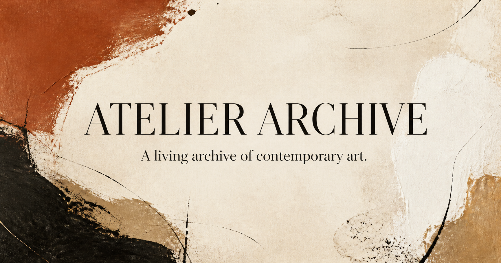

# Atelier Archive



A full-stack catalog for discovering, documenting, and managing contemporary art. Visitors can browse the collection, search by artist or medium, save works, and send inquiries. Signed-in artists can submit work for review, while administrators manage inventory, publication status, and incoming inquiries.

[Link](atelierrchive.netlify.app)

## Features

- Searchable, filterable public artwork catalog
- Artwork records with dimensions, pricing, provenance, availability, and imagery
- Artist directory generated from the published collection
- Email and password authentication with Supabase
- Member dashboard for saved works and private artwork submissions
- Admin workspace for approvals, catalog editing, inventory status, and inquiries
- Persistent artwork data in Cloudflare D1
- Image uploads backed by Cloudflare R2
- Responsive interface built for desktop and mobile

## Tech stack

- **Application:** React 19, TypeScript, and [Vinext](https://github.com/cloudflare/vinext)
- **Styling:** Tailwind CSS and shadcn/ui
- **Authentication:** Supabase Auth
- **Data:** Cloudflare D1 and Drizzle ORM
- **Storage:** Cloudflare R2
- **Runtime:** Cloudflare Workers
- **Tooling:** Vite, pnpm, Oxlint, and Oxfmt

## Getting started

### Prerequisites

- Node.js 22.13 or newer
- [pnpm](https://pnpm.io/installation)
- A [Supabase](https://supabase.com/) project
- Cloudflare D1 and R2 resources for persistent data and uploads

### Install

```bash
git clone https://github.com/xuanz9/atelier-archive.git
cd atelier-archive
pnpm install
```

Create a local environment file:

```bash
cp .env.example .env.local
```

On Windows PowerShell:

```powershell
Copy-Item .env.example .env.local
```

Add your Supabase project values to `.env.local`:

```dotenv
NEXT_PUBLIC_SUPABASE_URL=https://your-project.supabase.co
NEXT_PUBLIC_SUPABASE_PUBLISHABLE_KEY=sb_publishable_your_key

SUPABASE_URL=https://your-project.supabase.co
SUPABASE_PUBLISHABLE_KEY=sb_publishable_your_key
SUPABASE_JWKS_URL=https://your-project.supabase.co/auth/v1/.well-known/jwks.json

# Optional: comma-separated email addresses allowed to access /admin
ADMIN_EMAILS=admin@example.com
```

The application expects a D1 database binding named `DB` and an R2 bucket binding named `FILES`. The local Vite configuration supplies development bindings; production deployments must provide resources with the same names. Database migrations live in [`drizzle/`](drizzle/).

Start the development server:

```bash
pnpm dev
```

Open the local URL printed in the terminal. A populated, migrated D1 database is required for catalog pages and API routes.

## Commands

| Command | Description |
| --- | --- |
| `pnpm dev` | Start the local development server |
| `pnpm build` | Build the application for Cloudflare Workers |
| `pnpm start` | Run the built Worker locally with Wrangler |
| `pnpm lint` | Check the codebase with Oxlint |
| `pnpm format` | Format project files with Oxfmt |
| `pnpm db:generate` | Generate a Drizzle migration after schema changes |

## Project structure

```text
app/          Pages, layouts, and API routes
components/   Reusable interface components
db/           Drizzle database connection and schema
drizzle/      SQL migrations and migration metadata
hooks/        Shared React hooks
lib/          Catalog, authentication, and server utilities
public/       Static assets and social preview imagery
```

## Application areas

| Route | Purpose |
| --- | --- |
| `/` | Public catalog and artist directory |
| `/account` | Sign in or create an account |
| `/dashboard` | Manage personal submissions and saved works |
| `/admin` | Review submissions, manage inventory, and read inquiries |

Admin access is controlled by the `ADMIN_EMAILS` environment variable. Member submissions remain private until an administrator approves and publishes them.

## Data and uploads

The schema covers artists, artworks, artwork images, exhibitions, saved cart items, and inquiries. D1 stores structured records, while uploaded JPEG, PNG, and WebP artwork images are stored in R2 and served through the artwork API.

## Security

- Never commit `.env.local`, Supabase secret keys, or Cloudflare credentials.
- Only use `SUPABASE_SECRET_KEY` in server-side code when an operation must bypass Row Level Security.
- Restrict `ADMIN_EMAILS` to trusted accounts.
- Configure Supabase redirect URLs for the local and deployed application domains.

## Author

Created by [Rachel Zhu](https://github.com/xuanz9).
